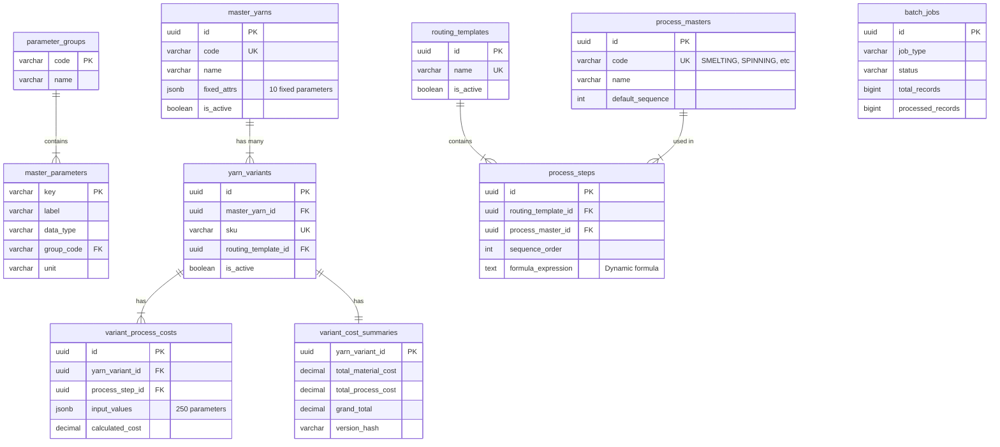

# Textile Costing Engine MVP

High-performance Golang backend untuk kalkulasi costing manufaktur tekstil, menggantikan sistem PHP yang membutuhkan 4 jam menjadi hitungan menit.

## 📋 Table of Contents

- [Overview](#-overview)
- [Architecture](#-architecture)
- [Database Design](#-database-design)
- [Calculation Workflow](#-calculation-workflow)
- [Performance Strategy](#-performance-strategy)
- [Quick Start](#-quick-start)
- [API Reference](#-api-reference)
- [Configuration](#-configuration)
- [Message Broker Strategy](#-message-broker-strategy)

---

## 🎯 Overview

### Problem Statement
Sistem costing tekstil lama (PHP) membutuhkan **4 jam** untuk menghitung ulang cost dari:
- 12.000 master yarn
- 350 children per master
- 120 parameter per child

### Solution
Backend Golang dengan:
- **Clean Architecture + DDD Pattern** - Kode maintainable dan testable
- **Worker Pool Concurrency** - 100+ goroutines paralel
- **PostgreSQL COPY Protocol** - Insert 100x lebih cepat
- **JSONB Parameters** - 250 parameter tanpa schema change
- **Table Partitioning** - Query paralel lebih optimal

### Target MVP
| Metric | Value |
|--------|-------|
| Master Yarns | 500,000 |
| Children per Master | 500 |
| Total Variants | 250,000,000 |
| Parameters per Variant | 250 |
| Target Recalculation Time | < 30 minutes |

---

## 🏗 Architecture

### System Architecture


### Project Structure
```
costing-mvp/
├── cmd/
│   ├── api/main.go           # REST API entry point (Fiber)
│   ├── worker/main.go        # Background worker untuk recalculation
│   ├── seeder/main.go        # High-performance data generator
│   └── migrate/main.go       # Database migration runner
├── config/
│   └── config.go             # Environment configuration
├── internal/
│   ├── domain/
│   │   ├── entity/           # Domain entities (MasterYarn, Variant, etc.)
│   │   └── repository/       # Repository interfaces (contracts)
│   ├── modules/
│   │   └── costing/          # Calculation engine & worker pool
│   └── infrastructure/
│       └── persistence/      # PostgreSQL implementations
├── pkg/
│   ├── database/             # Connection pooling (pgxpool)
│   └── formula/              # Dynamic expression parser (expr)
├── migrations/               # SQL migration files
├── docker-compose.yml        # PostgreSQL & pgAdmin
├── Dockerfile                # Multi-stage build
└── Makefile                  # Build commands
```

### Clean Architecture Flow


---

## 🗄 Database Design

### Entity Relationship Diagram


### Partitioning Strategy
Table `variant_process_costs` menggunakan **hash partitioning** dengan 16 partisi untuk distribusi data merata dan query paralel:

```sql
CREATE TABLE variant_process_costs (
    id UUID,
    yarn_variant_id UUID NOT NULL,
    ...
) PARTITION BY HASH (yarn_variant_id);

-- 16 partitions for parallel access
CREATE TABLE variant_process_costs_p0 
    PARTITION OF variant_process_costs 
    FOR VALUES WITH (MODULUS 16, REMAINDER 0);
-- ... p1 through p15
```

---

## ⚙️ Calculation Workflow

### Monthly Recalculation Flow

```mermaid
flowchart TD
    A[📅 Monthly Price Update] -->|API Request| B(POST /recalculate/all)
    B --> C{Create Batch Job}
    C --> D[(Save to batch_jobs<br/>status: PENDING)]
    
    D --> E[Dispatcher]
    
    subgraph "Worker Pool (100 goroutines)"
        E -->|Chunk 1000 IDs| W1[Worker 1]
        E -->|Chunk 1000 IDs| W2[Worker 2]
        E -->|Chunk 1000 IDs| W3[Worker N]
    end
    
    subgraph "Per Worker Process"
        W1 --> F1[1. Fetch Variant + Routing]
        F1 --> F2[2. Get Process Steps + Formulas]
        F2 --> F3[3. Parse & Calculate Each Step]
        F3 --> F4[4. Buffer Results]
    end
    
    F4 -->|Batch 1000| G[Bulk UPSERT<br/>using COPY Protocol]
    G --> H[(PostgreSQL)]
    
    W1 --> I[Update Job Progress]
    I --> D
    
    H --> J{All Complete?}
    J -->|Yes| K[Job Status: COMPLETED]
    J -->|No| E
```


### Formula Parsing Example


### Process Routing Example
Produk bisa melewati semua tahap atau hanya sebagian:


---

## 🚀 Performance Strategy

### Strategy Overview


### Comparison: Old vs New
| Aspect | PHP (Old) | Golang (New) |
|--------|-----------|--------------|
| Insert Method | Single INSERT | COPY Protocol |
| Concurrency | Sequential | 100 goroutines |
| Parameter Storage | EAV Table | JSONB |
| Estimated Time (250M) | ~4 hours | < 30 minutes |

---

## 🏁 Quick Start

### Prerequisites
- Go 1.22+
- Docker & Docker Compose
- Make (optional)

### 1. Start Infrastructure
```bash
# Start PostgreSQL (port 5433) and pgAdmin
docker-compose up -d postgres pgadmin

# Wait for PostgreSQL to be ready
docker-compose logs -f postgres
```

### 2. Run Migrations
```bash
# Copy environment file
cp .env.example .env

# Run migrations
go run ./cmd/migrate up
```

### 3. Seed Test Data
```bash
# Small test (1K × 100 = 100K variants)
# Performance metrics will be displayed
go run ./cmd/seeder --masters=1000 --children=100

# Medium stress test (10K × 200 = 2M variants)
go run ./cmd/seeder --masters=10000 --children=200

# Full MVP scale (500K × 500 = 250M variants)
# WARNING: Requires 32GB+ RAM
go run ./cmd/seeder --masters=500000 --children=500
```

### 4. Start API Server
```bash
go run ./cmd/api
# Server starts on http://localhost:8080
```

### 5. Trigger Recalculation
```bash
# Start recalculation
curl -X POST http://localhost:8080/api/v1/recalculate/all

# Check job status
curl http://localhost:8080/api/v1/jobs
```

---

## 📡 API Reference

### Health & Stats
| Method | Endpoint | Description |
|--------|----------|-------------|
| GET | `/health` | Health check |
| GET | `/api/v1/stats` | Database statistics (master count, variant count) |

### Master Yarns
| Method | Endpoint | Description |
|--------|----------|-------------|
| GET | `/api/v1/master-yarns` | List master yarns (pagination) |
| GET | `/api/v1/master-yarns/:id` | Get master yarn by ID |

### Cost Summaries
| Method | Endpoint | Description |
|--------|----------|-------------|
| GET | `/api/v1/cost-summaries` | List cost summaries |
| GET | `/api/v1/cost-summaries/:id` | Get cost by variant ID |

### Recalculation
| Method | Endpoint | Description |
|--------|----------|-------------|
| POST | `/api/v1/recalculate/all` | Trigger full recalculation (async) |
| GET | `/api/v1/jobs` | List recent jobs |
| GET | `/api/v1/jobs/:id` | Get job status & progress |

---

## ⚙️ Configuration

### Environment Variables
```bash
# Application
APP_ENV=development
APP_PORT=8080

# Database (PostgreSQL)
DB_HOST=localhost
DB_PORT=5433          # Changed from 5432
DB_USER=postgres
DB_PASSWORD=postgres
DB_NAME=costing
DB_POOL_MAX=50
DB_POOL_MIN=10

# Worker Configuration
WORKER_COUNT=100      # Number of concurrent goroutines
BATCH_SIZE=1000       # Records per batch
```

### PostgreSQL Tuning (docker-compose.yml)
```yaml
command:
  - "postgres"
  - "-c" "shared_buffers=512MB"
  - "-c" "work_mem=16MB"
  - "-c" "max_parallel_workers=8"
  - "-c" "max_connections=200"
```

---

## 📨 Message Broker Strategy

### Current Implementation: In-Process Channels
Saat ini menggunakan **Go channels** untuk komunikasi antar goroutine karena:
- MVP sederhana, single instance
- Tidak perlu persistence queue
- Latency minimal

### Recommended for Production: NATS JetStream

Untuk production dengan horizontal scaling, direkomendasikan **NATS JetStream** daripada RabbitMQ karena:

| Aspect | NATS JetStream | RabbitMQ |
|--------|---------------|----------|
| **Performance** | 10M+ msg/sec | 50K msg/sec |
| **Latency** | Sub-millisecond | Milliseconds |
| **Go Integration** | Native (built in Go) | Good |
| **Complexity** | Simple | More complex |
| **Persistence** | Built-in JetStream | Requires config |
| **Memory Usage** | Low | Higher |

### Future Architecture with NATS


### Migration Path
1. **Phase 1 (Current)**: Go channels (single instance)
2. **Phase 2**: Add NATS for job distribution
3. **Phase 3**: Kubernetes with multiple worker pods

---

## 📊 Performance Monitoring

### Built-in Metrics
Seeder dan worker menampilkan metrics otomatis:
```
Starting seeder: masters=10000, children=200
Progress: masters=2500/10000 (25.0%), variants=500000/2000000 (25.0%)
Progress: masters=5000/10000 (50.0%), variants=1000000/2000000 (50.0%)
...
Seeding completed in 2m35s
Total records: 10000 masters × 200 children = 2000000 variants
Throughput: 12,903 variants/second
```

### External Monitoring (Optional)
Untuk monitoring lebih detail, gunakan:
```bash
# Terminal 1: Run seeder
go run ./cmd/seeder --masters=10000 --children=200

# Terminal 2: Monitor PostgreSQL
docker stats costing-postgres

# Terminal 3: Monitor system resources
htop
# atau
btop
```

### pprof Profiling
```bash
# Enable pprof (add to API)
import _ "net/http/pprof"

# Access profiling
go tool pprof http://localhost:6060/debug/pprof/profile?seconds=30
```

---

## 🛠 Development

```bash
# Build all binaries
make build

# Run tests
make test

# Run linter
make lint

# View Docker logs
docker-compose logs -f

# Reset database
docker-compose down -v
docker-compose up -d postgres
go run ./cmd/migrate up
```

---

## 📄 License

MIT
