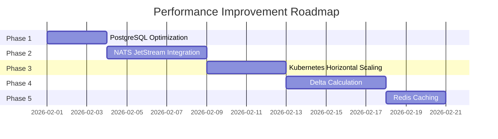
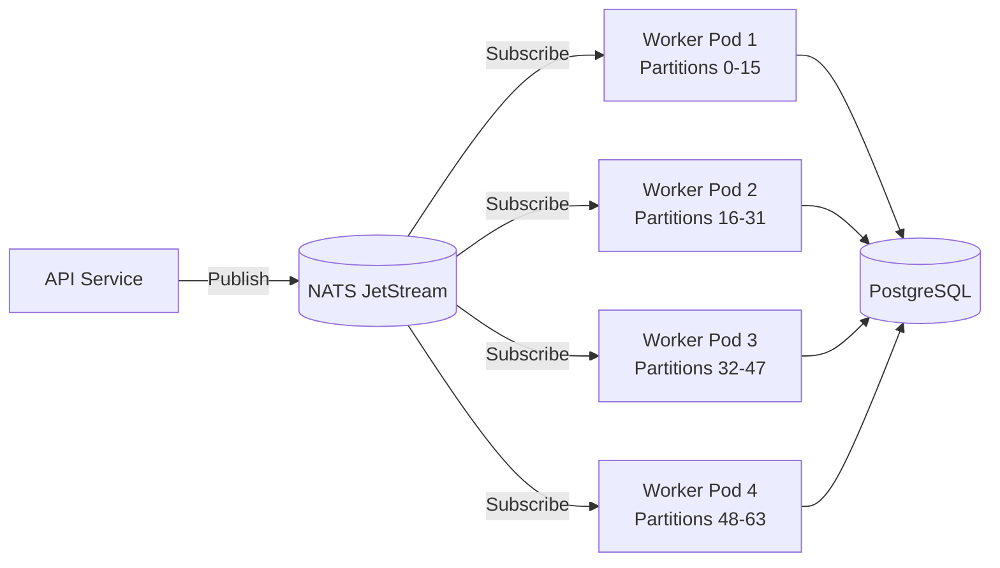
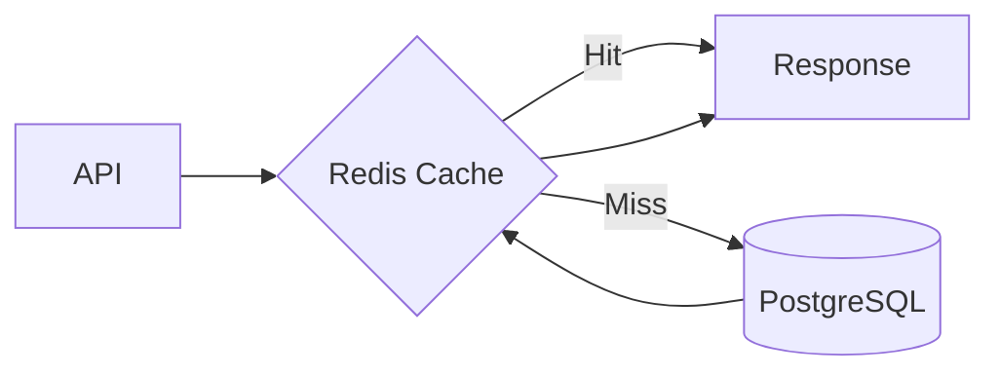

# Performance Improvement Roadmap

Dokumen ini berisi roadmap untuk meningkatkan performa Textile Costing Engine dari **2,100/s** menjadi target **50,000/s+**.

---

## 📊 Current Baseline

| Metric | Value |
|--------|-------|
| Throughput (MVP) | 2,104 variants/sec |
| 1M variants | 7m 55s |
| 250M variants (projected) | ~33 hours |
| **Target** | <60 minutes for 250M |

### Infrastructure
| Environment | CPU | RAM | Notes |
|-------------|-----|-----|-------|
| Staging | 4 cores | 8 GB | K8s cluster |
| Production | 8 cores | 16 GB | K8s cluster |

---

## 🎯 Improvement Phases



---

## Phase 1: PostgreSQL Optimization

**Expected Improvement: 2x-3x (4,000-6,000/s)**

### 1.1 Disable Sync Commit During Bulk
```sql
-- Before bulk operation
SET synchronous_commit = OFF;

-- After bulk operation  
SET synchronous_commit = ON;
```

### 1.2 Use UNLOGGED Table for Temp Processing
```sql
-- Create unlogged temp table
CREATE UNLOGGED TABLE variant_cost_summaries_staging (LIKE variant_cost_summaries);

-- Bulk insert to staging
COPY variant_cost_summaries_staging FROM ...;

-- Swap tables
BEGIN;
TRUNCATE variant_cost_summaries;
INSERT INTO variant_cost_summaries SELECT * FROM variant_cost_summaries_staging;
COMMIT;
```

### 1.3 Increase Partitions
```sql
-- Current: 16 partitions
-- Target: 64 partitions for better parallelism
```

### 1.4 PostgreSQL Config (Production)
```yaml
# postgresql.conf
shared_buffers: 4GB          # 25% of 16GB
work_mem: 128MB
maintenance_work_mem: 1GB
effective_cache_size: 12GB   # 75% of 16GB
max_parallel_workers: 8
max_parallel_workers_per_gather: 4
random_page_cost: 1.1        # SSD
```

### Implementation Steps
- [ ] Update docker-compose with production PostgreSQL settings
- [ ] Create migration for 64 partitions
- [ ] Modify `UpsertBatch` to use UNLOGGED staging table
- [ ] Add connection option for `synchronous_commit`

---

## Phase 2: NATS JetStream Integration

**Expected Improvement: 5x with horizontal scaling**

### 2.1 Architecture


### 2.2 Message Format
```go
type RecalculationJob struct {
    JobID        uuid.UUID
    PartitionStart int  // 0
    PartitionEnd   int  // 15
    BaseParams   map[string]interface{}
}
```

### 2.3 Docker Compose Addition
```yaml
nats:
  image: nats:2.10-alpine
  command: ["--jetstream"]
  ports:
    - "4222:4222"
    - "8222:8222"  # Monitoring
```

### Implementation Steps
- [ ] Add `github.com/nats-io/nats.go` dependency
- [ ] Create NATS connection pool
- [ ] Create `RecalculationJobPublisher` in API
- [ ] Create `RecalculationJobConsumer` in Worker
- [ ] Add partition range parameter to `RecalculateAll`
- [ ] Update Dockerfile for NATS-enabled worker

---

## Phase 3: Kubernetes Horizontal Scaling

**Expected Improvement: Linear with pod count**

### 3.1 Worker Deployment (Staging - 4 cores)
```yaml
# k8s/staging/worker-deployment.yaml
apiVersion: apps/v1
kind: Deployment
metadata:
  name: costing-worker
spec:
  replicas: 2  # 2 pods x 50 workers = 100 goroutines
  template:
    spec:
      containers:
      - name: worker
        image: costing-mvp:latest
        command: ["./worker"]
        env:
        - name: WORKER_COUNT
          value: "50"
        - name: BATCH_SIZE
          value: "2000"
        - name: PARTITION_START
          valueFrom:
            fieldRef:
              fieldPath: metadata.annotations['partition-start']
        resources:
          requests:
            cpu: "1500m"
            memory: "2Gi"
          limits:
            cpu: "2000m"
            memory: "3Gi"
```

### 3.2 Worker Deployment (Production - 8 cores)
```yaml
# k8s/production/worker-deployment.yaml
apiVersion: apps/v1
kind: Deployment
metadata:
  name: costing-worker
spec:
  replicas: 4  # 4 pods x 100 workers = 400 goroutines
  template:
    spec:
      containers:
      - name: worker
        image: costing-mvp:latest
        command: ["./worker"]
        env:
        - name: WORKER_COUNT
          value: "100"
        - name: BATCH_SIZE
          value: "5000"
        resources:
          requests:
            cpu: "1500m"
            memory: "3Gi"
          limits:
            cpu: "2000m"
            memory: "4Gi"
```

### 3.3 HPA for Auto-scaling
```yaml
# k8s/production/worker-hpa.yaml
apiVersion: autoscaling/v2
kind: HorizontalPodAutoscaler
metadata:
  name: costing-worker-hpa
spec:
  scaleTargetRef:
    apiVersion: apps/v1
    kind: Deployment
    name: costing-worker
  minReplicas: 2
  maxReplicas: 8
  metrics:
  - type: Resource
    resource:
      name: cpu
      target:
        type: Utilization
        averageUtilization: 70
```

### 3.4 Resource Planning

| Environment | Pods | Workers/Pod | Total Goroutines | Est. Throughput |
|-------------|------|-------------|------------------|-----------------|
| Staging | 2 | 50 | 100 | 5,000/s |
| Production | 4 | 100 | 400 | 15,000/s |
| Production (scaled) | 8 | 100 | 800 | 30,000/s |

### Implementation Steps
- [ ] Create `k8s/staging/` directory with manifests
- [ ] Create `k8s/production/` directory with manifests
- [ ] Add partition-aware worker logic
- [ ] Configure NATS connection in K8s
- [ ] Set up HPA for auto-scaling
- [ ] Create Helm chart (optional)

---

## Phase 4: Delta Calculation

**Expected Improvement: 50-90% reduction in work**

### 4.1 Concept
Hanya recalculate variants yang terpengaruh:
- Price rate berubah → recalculate variants yang menggunakan rate tersebut
- Formula berubah → recalculate variants dengan routing tersebut
- Parameter variant berubah → recalculate variant tersebut saja

### 4.2 Change Tracking Table
```sql
CREATE TABLE calculation_changes (
    id UUID PRIMARY KEY,
    change_type VARCHAR(50),  -- 'PRICE_RATE', 'FORMULA', 'VARIANT'
    affected_key VARCHAR(255), -- parameter_key or routing_id or variant_id
    old_value JSONB,
    new_value JSONB,
    created_at TIMESTAMP DEFAULT NOW(),
    processed_at TIMESTAMP NULL
);

CREATE INDEX idx_changes_unprocessed ON calculation_changes(processed_at) 
    WHERE processed_at IS NULL;
```

### 4.3 Smart Recalculation
```go
type DeltaCalculator struct {
    // Get affected variants based on change type
}

func (d *DeltaCalculator) GetAffectedVariants(change *Change) []uuid.UUID {
    switch change.Type {
    case "PRICE_RATE":
        // All variants (price affects all)
        return d.getAllVariantIDs()
    case "FORMULA":
        // Only variants with this routing
        return d.getVariantsByRouting(change.AffectedKey)
    case "VARIANT":
        // Only this variant
        return []uuid.UUID{uuid.MustParse(change.AffectedKey)}
    }
}
```

### Implementation Steps
- [ ] Create `calculation_changes` migration
- [ ] Add triggers on `price_rates` and `process_steps`
- [ ] Create `DeltaCalculator` service
- [ ] Modify API to support delta mode
- [ ] Add CLI flag for full vs delta recalculation

---

## Phase 5: Redis Caching

**Expected Improvement: Sub-ms read latency**

### 5.1 Architecture


### 5.2 Cache Strategy
| Data | TTL | Key Pattern |
|------|-----|-------------|
| Cost Summary | 1 hour | `cost:summary:{variant_id}` |
| Routing Steps | 24 hours | `routing:steps:{routing_id}` |
| Price Rates | 1 hour | `price:rates:current` |

### 5.3 Docker Compose Addition
```yaml
redis:
  image: redis:7-alpine
  command: redis-server --maxmemory 512mb --maxmemory-policy allkeys-lru
  ports:
    - "6379:6379"
```

### Implementation Steps
- [ ] Add `github.com/redis/go-redis/v9` dependency
- [ ] Create cached repository wrappers
- [ ] Implement cache invalidation on write
- [ ] Add cache warmup on startup
- [ ] Configure Redis in K8s with persistence

---

## 📈 Expected Results

| Phase | Throughput | 1M Time | 250M Time |
|-------|------------|---------|-----------|
| Current | 2,100/s | 8 min | 33 hours |
| Phase 1 | 5,000/s | 3 min | 14 hours |
| Phase 2+3 (4 pods) | 20,000/s | 50 sec | 3.5 hours |
| Phase 2+3 (8 pods) | 40,000/s | 25 sec | 1.7 hours |
| Phase 4 (delta 90%) | - | - | 10-20 min |
| Phase 5 | Sub-ms reads | - | - |

---

## 🔧 Quick Wins (Bisa dilakukan sekarang)

1. **Increase PostgreSQL max_connections** to 500
2. **Add `prepared_statements: prefer`** to pgx config
3. **Use `pgx.Batch`** for multiple queries
4. **Pre-allocate slices** dengan capacity yang tepat
5. **Profile dengan pprof** untuk identify bottlenecks

---

## 📚 References

- [NATS JetStream Documentation](https://docs.nats.io/nats-concepts/jetstream)
- [PostgreSQL COPY Performance](https://www.postgresql.org/docs/current/populate.html)
- [Kubernetes HPA](https://kubernetes.io/docs/tasks/run-application/horizontal-pod-autoscale/)
- [Go pprof Profiling](https://go.dev/blog/pprof)
